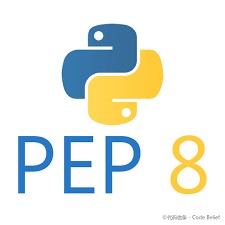

<div style="text-align: center">

</div>
<h1 style="text-align: center">Проект - онлайн магазин.</h1>

Краткое описание:
Разработано веб-приложение для телеграмм бота - онлайн магазин, которое позволит эффективно повысить уровень продаж.

1. Каталог товаров:
   * покупатели могут просматривать товары;
   * сортировать их по категориям.


2. Корзина покупок:
   * возможность добавлять товары в корзину;
   * удалять товары из корзины;


3. Кабинет покупателя:
   * редактирование личной информации;
   * просмотр истории заказов.
   


---

### 
Для начальной настройки , Вам необходимо создать виртуальное окружение. 
Файл .env.template переименовать в .env, заполнить соответствующие параметры 

---

### 
Запуск через Docker-compose:
Открываем терминал, переходим в корневую папку с проектом:

1. Создаём образ командой ```docker-compose -build```
2. Поднимаем контейнер ```docker-compose up```

---

### 
Проверено линтерами (black, isort, flake8, mypy).

---

### 
Проект распространяется под лицензией MIT.

---
